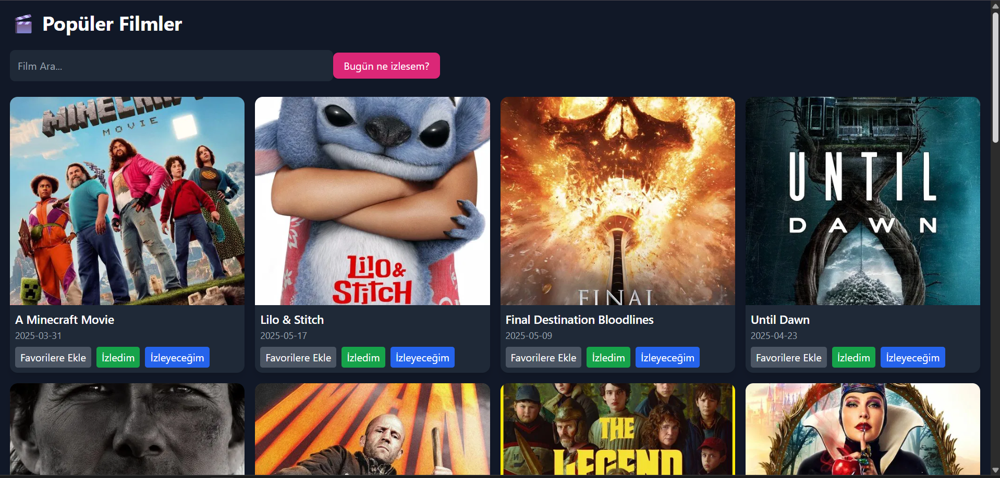

# Movie Tracker App

A modern React application that allows users to discover popular movies, search for specific titles, and view detailed information about them.

## ✨ Features

- Displays the most popular movies using the TMDB API
- Search functionality for finding specific movies
- Responsive and clean UI with Tailwind CSS
- Lightning-fast development with Vite

## 🚀 Technologies Used

- React
- Vite
- TailwindCSS
- TMDB API
- ## Ekran Görüntüleri


.png)


## 📦 Installation

```bash
git clone https://github.com/havvakrbck1/movie-tracker-app.git
cd movie-tracker-app
npm install
npm run dev
